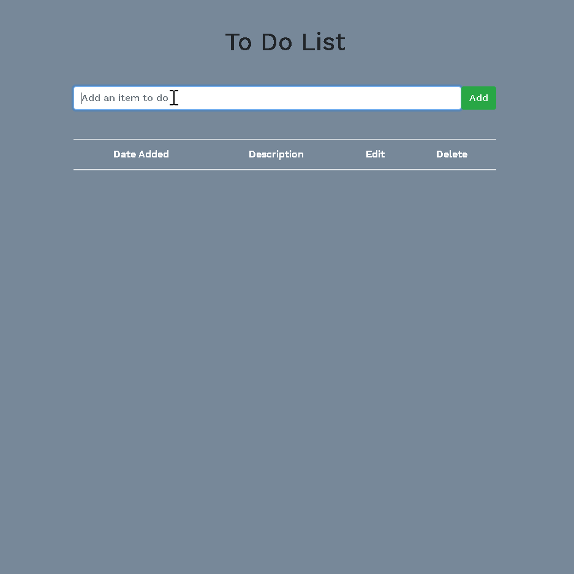

# pern-todo-tool

A React application which helps users list out their tasks.

## Demo

[To Do List](https://pern-todo-tool.herokuapp.com/)

## Technologies Used

PERN stack: PostgreSQL, Express, React, Node.js

